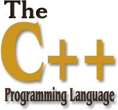

# C++学习记录（I）

## C++是什么



# 📘 C++ 学习笔记


## 📚 目录

1. [基础语法](#基础语法)
   - [Hello World](#hello-world)
   - [变量与基本类型](#变量与基本类型)
   - [运算符](#运算符)
   - [控制结构](#控制结构)
   - [函数](#函数)

2. [面向对象编程 (OOP)](#面向对象编程-oop)
   - [类与对象](#类与对象)
   - [构造函数与析构函数](#构造函数与析构函数)
   - [访问修饰符](#访问修饰符)
   - [继承与多态](#继承与多态)

3. [STL 常用容器与算法](#stl-常用容器与算法)
   - [vector](#vector)
   - [string](#string)
   - [map / unordered_map](#map--unordered_map)
   - [set / unordered_set](#set--unordered_set)
   - [algorithm](#algorithm)

4. [指针与引用](#指针与引用)
   - [指针](#指针)
   - [引用](#引用)
   - [动态内存管理](#动态内存管理)

5. [模板与泛型编程](#模板与泛型编程)
   - [函数模板](#函数模板)
   - [类模板](#类模板)

6. [智能指针](#智能指针)
   - [unique_ptr](#unique_ptr)
   - [shared_ptr](#shared_ptr)
   - [weak_ptr](#weak_ptr)

7. [Lambda 表达式](#lambda-表达式)

8. [命名空间](#命名空间)

9. [异常处理](#异常处理)

10. [文件操作](#文件操作)

11. [移动语义与完美转发 (C++11+)](#移动语义与完美转发-c11)

12. [并发编程 (OpenMP & std::thread)](#并发编程-openmp--stdthread)

---

## 🔤 基础语法

### Hello World

```cpp
#include <iostream>
using namespace std;

int main() {
    cout << "Hello, World!" << endl;
    return 0;
}
```

### 变量与基本类型

| 类型 | 示例 |
|------|------|
| int | 整数 |
| double | 浮点数 |
| char | 字符 |
| bool | 布尔值 |
| string | 字符串（需包含 `<string>`） |

```cpp
int age = 20;
double price = 9.99;
char grade = 'A';
bool is_student = true;
string name = "Alice";
```

### 运算符

- 算术：`+`, `-`, `*`, `/`, `%`
- 比较：`==`, `!=`, `<`, `>`, `<=`, `>=`
- 逻辑：`&&`, `||`, `!`
- 赋值：`=`, `+=`, `-=`, `*=`, `/=`

### 控制结构

#### if-else

```cpp
if (age > 18) {
    cout << "成年人" << endl;
} else {
    cout << "未成年人" << endl;
}
```

#### for 循环

```cpp
for (int i = 0; i < 5; ++i) {
    cout << i << " ";
}
```

#### while / do-while

```cpp
int i = 0;
while (i < 5) {
    cout << i << " ";
    ++i;
}

do {
    cout << i << " ";
    ++i;
} while (i < 5);
```

#### switch-case

```cpp
switch (grade) {
    case 'A': cout << "优秀"; break;
    case 'B': cout << "良好"; break;
    default: cout << "其他";
}
```

### 函数

```cpp
int add(int a, int b) {
    return a + b;
}

int main() {
    int result = add(3, 4);
    cout << result << endl;
    return 0;
}
```

---

## 🧱 面向对象编程 (OOP)

### 类与对象

```cpp
class Person {
public:
    string name;
    int age;

    void introduce() {
        cout << "我叫" << name << "，今年" << age << "岁。" << endl;
    }
};

int main() {
    Person p;
    p.name = "Tom";
    p.age = 25;
    p.introduce();
    return 0;
}
```

### 构造函数与析构函数

```cpp
class Person {
public:
    string name;
    int age;

    // 构造函数
    Person(string n, int a) : name(n), age(a) {}

    // 析构函数
    ~Person() {
        cout << name << "被销毁了" << endl;
    }

    void introduce() {
        cout << "我叫" << name << "，今年" << age << "岁。" << endl;
    }
};
```

### 访问修饰符

| 关键字 | 描述 |
|--------|------|
| public | 公有成员，可从外部访问 |
| private | 私有成员，只能在类内部访问 |
| protected | 受保护成员，可在派生类中访问 |

### 继承与多态

```cpp
class Animal {
public:
    virtual void speak() { cout << "Animal sound" << endl; }
};

class Dog : public Animal {
public:
    void speak() override { cout << "Woof!" << endl; }
};

int main() {
    Animal* a = new Dog();
    a->speak(); // 输出 Woof!
    delete a;
    return 0;
}
```

---

## 📦 STL 常用容器与算法

### vector

```cpp
#include <vector>
vector<int> nums = {1, 2, 3};
nums.push_back(4);

for (int n : nums) {
    cout << n << " ";
}
```

### string

```cpp
#include <string>
string s = "Hello";
s += " World";
cout << s << endl;
```

### map / unordered_map

```cpp
#include <map>
map<string, int> scores;
scores["Alice"] = 90;
scores["Bob"] = 85;

for (auto& pair : scores) {
    cout << pair.first << ": " << pair.second << endl;
}
```

### set / unordered_set

```cpp
#include <set>
set<int> numbers = {1, 2, 3, 2}; // 自动去重
for (int n : numbers) {
    cout << n << " "; // 输出 1 2 3
}
```

### algorithm

```cpp
#include <algorithm>
#include <vector>
vector<int> v = {3, 1, 4, 2};
sort(v.begin(), v.end()); // 排序
reverse(v.begin(), v.end()); // 反转
```

---

## 🔗 指针与引用

### 指针

```cpp
int x = 10;
int* p = &x;
cout << *p << endl; // 输出 10
```

### 引用

```cpp
int y = 20;
int& ref = y;
ref = 30;
cout << y << endl; // 输出 30
```

### 动态内存管理

```cpp
int* arr = new int[5];
arr[0] = 1;
delete[] arr;
```

---

## 🧩 模板与泛型编程

### 函数模板

```cpp
template<typename T>
T max(T a, T b) {
    return (a > b) ? a : b;
}

int main() {
    cout << max(3, 5) << endl;      // 输出 5
    cout << max('a', 'c') << endl;  // 输出 c
    return 0;
}
```

### 类模板

```cpp
template<typename T>
class Box {
public:
    T value;
    Box(T v) : value(v) {}
};

int main() {
    Box<int> box1(100);
    Box<string> box2("Hello");
    return 0;
}
```

---

## 💡 智能指针

### unique_ptr

```cpp
#include <memory>
auto ptr = make_unique<int>(20);
cout << *ptr << endl;
// 不支持复制，但可以移动
```

### shared_ptr

```cpp
auto sptr1 = make_shared<int>(30);
auto sptr2 = sptr1; // 引用计数变为 2
```

### weak_ptr

```cpp
weak_ptr<int> wptr = sptr1; // 不增加引用计数
if (auto spt = wptr.lock()) {
    cout << *spt << endl;
}
```

---

## 🎭 Lambda 表达式

```cpp
#include <vector>
#include <algorithm>

vector<int> v = {1, 2, 3, 4, 5};
int factor = 2;

for_each(v.begin(), v.end(), [factor](int& n) {
    n *= factor;
});
```

---

## 📁 命名空间

```cpp
namespace Math {
    int add(int a, int b) {
        return a + b;
    }
}

int main() {
    cout << Math::add(2, 3) << endl;
    return 0;
}
```

---

## ⚠️ 异常处理

```cpp
try {
    throw runtime_error("出错了！");
} catch (const exception& e) {
    cout << e.what() << endl;
}
```

---

## 📁 文件操作

```cpp
#include <fstream>

ofstream out("output.txt");
out << "写入文件的内容" << endl;
out.close();

ifstream in("output.txt");
string line;
while (getline(in, line)) {
    cout << line << endl;
}
in.close();
```

---

## 🚀 移动语义与完美转发 (C++11+)

### 移动构造函数

```cpp
class MyClass {
public:
    MyClass(MyClass&& other) noexcept {
        // 资源转移逻辑
    }
};
```

### 完美转发

```cpp
template<typename T>
void wrapper(T&& arg) {
    someFunction(forward<T>(arg));
}
```

---

## 🧵 并发编程 (OpenMP & std::thread)

### OpenMP 多线程示例

```cpp
#pragma omp parallel for
for (int i = 0; i < 10; ++i) {
    cout << "Thread " << omp_get_thread_num() << endl;
}
```

### std::thread 示例

```cpp
#include <thread>
void hello() {
    cout << "Hello from thread!" << endl;
}

int main() {
    thread t(hello);
    t.join();
    return 0;
}
```

---
