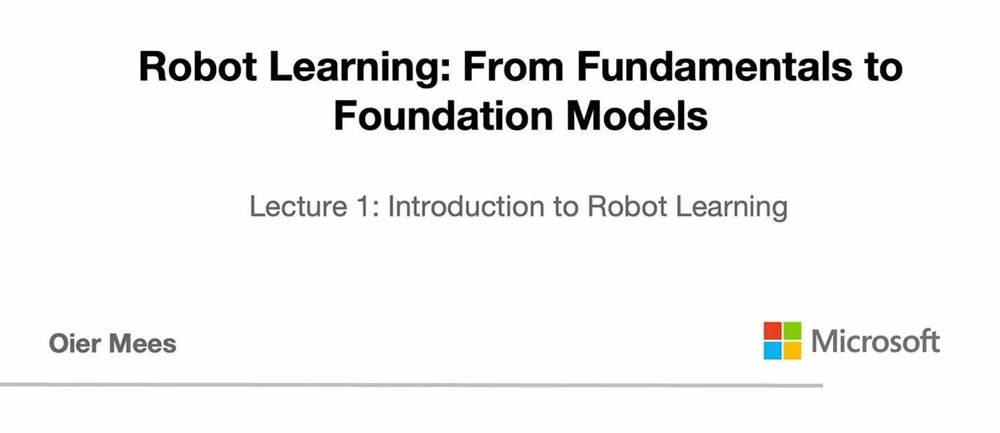

- 课程网站: [Robot learning](http://cvg.ethz.ch/lectures/Robot-Learning/)
- 课程作业网站: [mees-robot-learning-course/ethz-course-2026](https://github.com/mees-robot-learning-course/ethz-course-2026)
- 课程视频: [Youtube](https://www.youtube.com/watch?v=X0k14u6pSxw)

## 机器人学习基础

这一讲的核心问题是：为什么机器人已经有很强的硬件，却仍然很难在开放世界中可靠地自主行动？课程给出的答案是机器人学习：用机器学习方法，让机器人从数据和经验中获得技能，而不是只依赖人工编写的规则、模型和状态机。

### 为什么需要机器人

机器人首先回应现实需求。很多任务对人类来说危险、遥远、脏乱或高强度，例如太空探索、深海探索、地下采矿、灾后搜救等。机器人也可能缓解医疗和养老系统压力，在家庭中提供个性化辅助与照护。

从更大的 AI 发展脉络看，计算机视觉和自然语言处理已经从手工设计的专用模型，走向 transformer 和 foundation model 驱动的通用模型。机器人领域正在尝试把这种范式迁移到物理世界中：让机器人不仅能感知和控制，还能在复杂环境中泛化、推理和自主决策。

### 经典机器人范式：sense-plan-act

早期代表是 1966 年 SRI 的 Shakey robot。Shakey 通过摄像头和距离传感器感知环境，在已知房间、门和简单物体构成的实验环境中规划行动，再执行移动和推动物体等操作。A* 路径规划算法也与这类机器人研究密切相关。

Shakey 体现了经典机器人学的基本循环：

1. 感知世界。
2. 在内部模型或地图中规划。
3. 执行动作。

后来的工业机器人在结构化环境中极其成功，例如汽车装配线上的机械臂。它们通常依赖已知地图、几何规划、高精度控制和明确的状态转移。但这种成功建立在封闭世界假设上：环境稳定、目标明确、变化有限。一旦零件位置、光照、接触状态或任务条件发生变化，手写逻辑和状态机很难覆盖所有边界情况。

### Moravec 悖论

Moravec 悖论指出：人类觉得困难的抽象推理，例如数学、棋类和战略规划，对 AI 来说相对容易；而动物和幼儿轻松完成的感知运动技能，例如抓取、行走、接触和工具使用，对 AI 来说极其困难。

原因在于物理交互没有互联网文本那样的现成数据。语言模型可以从海量文本中学习，但机器人若要学习“如何抓住杯子”，通常需要真实或仿真的交互数据。采集这些数据成本高、速度慢，还会受硬件差异、传感器噪声和安全风险限制。

### 什么是机器人学习

本讲给出的工作定义是：机器人学习就是用机器学习解决机器人问题。

更具体地说，机器人学习研究让机器人通过数据和经验获得新技能、适应非结构化环境的算法，而不是完全依赖显式建模和手工编程。它试图把两个领域连接起来：

- 机器人学提供物理世界中的感知、控制、动力学和执行系统。
- 机器学习提供从数据中学习、泛化和适应的工具，例如模仿学习、强化学习、表示学习和 foundation models。

课程强调的目标不是只做演示，而是理解支撑这些系统的算法框架：从低层 PID 控制、机器人控制和 Markov decision processes，到模仿学习、在线/离线强化学习，再到生成模型、sequence modeling、world models 和高层推理。

### 如何判断一个系统是不是机器人

一个有用的判断角度是：系统是否有物理 embodiment，是否能改变物理世界，以及是否具备一定自主性。

洗碗机能改变物理世界，并以稳定方式完成固定任务，因此可以被视为一种非常受限但可靠的机器人。达芬奇手术机器人有很强的物理灵巧性，但主要是医生远程操作，严格说并不具备完整自主性。手机上的 ChatGPT 有高层推理能力，却没有物理 embodiment，也不能直接作用于世界。

机器人学习真正关心的是这些能力的交汇：像家电一样可靠，像手术机械臂一样灵巧，同时具有 foundation model 级别的通用推理能力。

### 为什么家里还没有通用自主机器人

2007 年 Stanford 的 PR1 已经能通过远程操作完成整理房间等家庭任务。这说明执行这些任务的硬件很早就存在；缺失的关键是能让机器人自主完成任务的软件，也就是“机器人脑”。

今天的硬件和算力已经大幅提升。人形机器人从研究原型走向商业化平台，GPU 集群让大模型训练成为可能。但机器人仍然面临几个根本难题：

- 数据稀缺：机器人数据通常需要人类遥操作或监督采集，成本远高于文本和图片。
- 数据异质：不同机器人有不同传感器、执行器、自由度和动作空间。
- 实时性要求高：机器人控制不能等待大模型慢速返回动作，延迟和模型大小直接影响安全与稳定。
- 评估成本高：真实硬件实验耗时、昂贵，并且可能损坏设备。

### 从专用策略到通用机器人策略

机器人学习的长期目标是 generalist robot policies，也就是机器人 foundation models。理想情况下，一个模型可以从大规模、多机器人、多任务的数据中学习，并在任意机器人、任意任务、任意环境中输出合理动作。

Open X-Embodiment 这类数据集代表了这一方向的尝试：把来自不同机构、不同机器人形态的数据整理到统一格式中，使社区可以训练和比较更通用的机器人策略。Octo、RT-2、Pi-0 等模型都是这一方向上的代表。

这也意味着机器人领域正在从手写程序时代走向发现时代：机器人不只是复现人类写好的规则，而是可能通过学习找到人类没有显式设计过的物理问题解法。

### 把机器人问题看作多模态序列建模

现代机器人策略常见的输入是当前图像观测和自然语言任务指令，例如“pick up the spoon”。模型输出的不是文本，而是一段机器人动作，例如末端执行器位姿序列。

这与视觉语言模型有相似结构：视觉语言模型把图像和文本指令映射到文本回答；机器人策略把图像和语言指令映射到动作。于是可以把机器人学习形式化为多模态序列建模问题：

- language tokens 表示任务和语义。
- image tokens 表示视觉观测。
- action tokens 表示机器人动作。

这样做的好处是可以借用视觉和 NLP 社区在 transformer、attention 和 sequence modeling 上的进展。但机器人不能简单等价为“在机器人数据上训练一个大 transformer”，因为它还必须处理物理交互、实时控制、安全评估和跨硬件泛化。

### 两大基础算法框架

模仿学习可以理解为物理世界中的监督学习。给定专家演示数据，模型学习从观测到专家动作的映射。经典行为克隆通常隐含 IID 假设：训练样本彼此独立，并来自同一分布。因此，只要测试分布偏离训练分布，策略就可能出现误差累积。

强化学习则通过与环境试错来学习策略，目标是最大化奖励。它与模仿学习的关键差异在于数据不是 IID 的：机器人当前动作会改变未来状态，也会改变之后能观察和学习到的数据。这种反馈循环让强化学习更适合描述自主交互，但也带来更高的训练成本和稳定性挑战。

### 本讲主线

机器人学习要解决的是从硬编码系统到 learned physical intelligence 的转变。过去的机器人依赖明确的世界模型、几何规划和精确状态估计；未来的机器人需要从数据中学习，在开放环境中泛化，并把感知、控制、推理和动作统一起来。

这一转变不仅适用于机械臂操作，也适用于自动驾驶、人形机器人、太空机器人等场景。学习机器人学习的价值在于它横跨整个技术栈：从 foundation models 和高层推理，到真实硬件上的低层控制。核心问题始终是同一个：如何让智能体在真实物理世界中可靠行动。
