## 课程说明

课程资源

- 课程网站: [Robot learning](http://cvg.ethz.ch/lectures/Robot-Learning/)
- 课程作业网站: [mees-robot-learning-course/ethz-course-2026](https://github.com/mees-robot-learning-course/ethz-course-2026)

本文合并整理 Lecture 2 和 Lecture 3，具体保留与机器人控制、Markov decision processes 和 imitation learning 直接相关的部分。公式见robotlearning

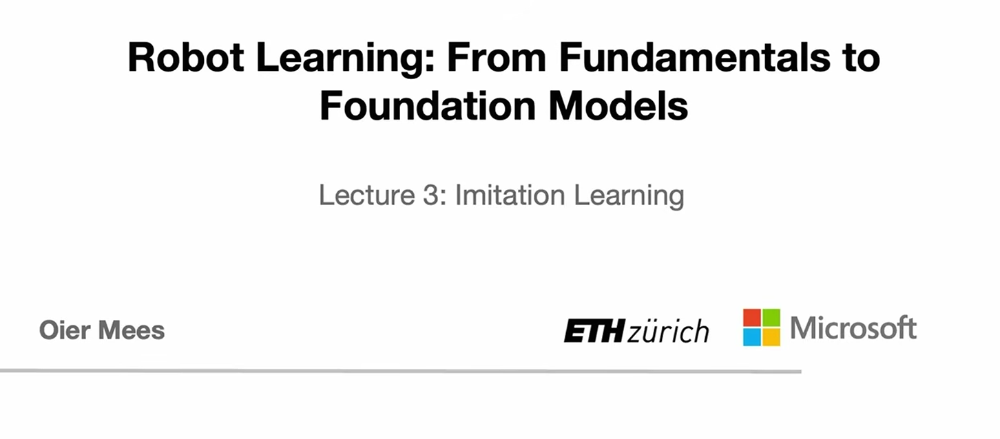

## 从机器人控制到策略学习

这两讲回答的是一个连续问题：机器人如何把高层目标变成真实世界中的动作，又如何从数据中学习这种动作选择？

第 2 讲先补齐机器人控制的基础语言：刚体、坐标系、关节、自由度、配置空间、工作空间、任务空间、正逆运动学、轨迹生成和 PID 控制。它解释了“动作”在物理机器人上到底意味着什么。第 3 讲在这个基础上进入模仿学习：如果已经有专家演示，我们如何训练一个策略 $pi_theta$ 从状态或观测映射到动作，并处理分布偏移、非 Markov 行为和多模态行为这些现实问题。

### 机器人控制的共同语言

不同机器人看起来差异很大：四足机器人、灵巧手、无人机、机械臂和自动驾驶汽车的形态、关节和执行器都不同。但在控制层面，大多数机器人都可以被描述为一组在空间中运动的*刚体*。刚体假设的意思是，物体上任意两点之间的距离保持不变，因此机器人不会在运动中被拉伸或压缩。

平面运动常用 `SE(2)` 表示，例如地面车辆在 `x-y` 平面上的位置和朝向。三维空间运动常用 `SE(3)` 表示，例如无人机的三维平移以及 roll、pitch、yaw 三个旋转自由度。代码中通常用齐次变换矩阵表示位姿，其中旋转矩阵需要满足两个条件：转置等于逆矩阵，行列式为 1。这样才能保证它表示的是纯旋转，而不是把物体拉伸或反射。

真实机器人通常不是一个坐标系，而是一整套坐标系层级。自动驾驶汽车有车体坐标系，车顶相机或激光雷达又有各自的传感器坐标系。当传感器在自己的坐标系中看到行人时，控制器需要把这个位置转换回车体坐标系，才能决定车辆如何运动。齐次变换矩阵的价值就在这里：可以通过矩阵连乘在不同坐标系之间转换。

### 连杆、关节和末端执行器

更复杂的机器人可以看作 articulated rigid bodies（铰接刚体），也就是由多个刚体连杆通过关节连接起来的系统。一个机械臂通常包含三类元素：

- links：单个刚体连杆。
- joints：限制两个连杆相对运动的数学约束。
- end effectors：与外界交互的末端执行器，例如夹爪、吸盘或灵巧手。

在常见机械臂中，最重要的关节类型是 revolute joint，也就是绕单一轴旋转的关节，类似人的肘关节。末端执行器则直接决定动作空间的复杂度。吸盘夹爪几乎是二值动作：开或关；平行夹爪通常是一维开合动作；灵巧手可能有二十多个自由度，动作空间复杂得多。

### 自由度、配置空间和工作空间

自由度表示确定机器人当前构型所需的独立参数数量。自由度越高，机器人越灵活，但控制和学习也越困难。Kutzbach formula 的思想是：从刚体在空间中的可能运动维度出发，再减去各个关节施加的约束。
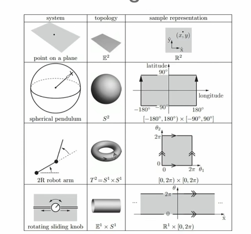
配置空间（configuration space, C-space）是机器人所有可能构型组成的空间。对一个平面上的点，它可能就是普通欧氏空间；对一个有两个 revolute joints 的平面机械臂，它的配置空间不是平面，而更像一个环面。这个拓扑结构很重要，因为角度会“绕回去”：从 356 度到 1 度的最短路径不是反向走 355 度，而是跨过边界走很小一段。

工作空间（workspace）是机器人在物理世界中能到达的点的集合。机器人学习中经常同时面对两个世界：任务通常在工作空间中被感知，例如看到桌上的杯子；动作却需要在配置空间中执行，例如转动各个关节。二者之间的映射并不简单。

任务空间（task space）是目标自然定义的空间，它不一定依赖具体机器人形态。例如“擦白板”这个任务的任务空间可以是白板表面上的点；执行者可以是人形机器人、移动机械臂，甚至理论上也可以是飞行机器人。

### 为什么经典几何规划不够

传统运动规划可以显式构造配置空间，并把物理世界中的障碍物转换成配置空间中的 forbidden regions，然后在 free space 中搜索路径。这种方法在低维、结构化环境中很清晰，但维度一高就很难扩展。一个 7 自由度机械臂、双臂系统或人形机器人会让这些几何计算变得非常昂贵。

现代机器人学习不希望每次都手工构造完整的几何世界模型，而是希望策略从数据中隐式学到哪些动作会导致碰撞、失败或低回报。这里的范式变化是：从显式几何和手写规则，转向 learned representations(学习表征)。从硬编码到学习方法的飞跃。

Franka 机械臂是一个典型例子：它的配置空间是 7 维关节角空间；工作空间是末端执行器在三维物理空间中可到达的位置集合；任务空间可以是末端执行器的 6D pose。因为配置空间通常比任务空间维度更高，同一个末端位置可能对应许多关节构型，这带来了冗余和 null-space motion(**在不改变末端执行器（或某个关键任务量）位姿的前提下，关节空间中可以发生的“自运动”或“内部运动"**)。例如机械臂可以保持杯子不动，同时移动肘部来绕开障碍物。

### 正运动学、逆运动学和轨迹生成

正运动学回答的问题是：已知所有关节角，末端执行器在哪里？这是确定性的，因为一组关节值对应一个唯一末端位姿。（forward kinematics)

逆运动学回答的问题相反：给定目标末端位姿，哪些关节角可以到达那里？这更难，因为解通常不唯一，也可能没有解析解。实际系统中常用优化式逆运动学：定义当前末端位姿和目标位姿之间的误差，再加入避障、关节限制等次级约束，通过 Jacobian 方法和梯度迭代更新关节角。(inverse kinematics)

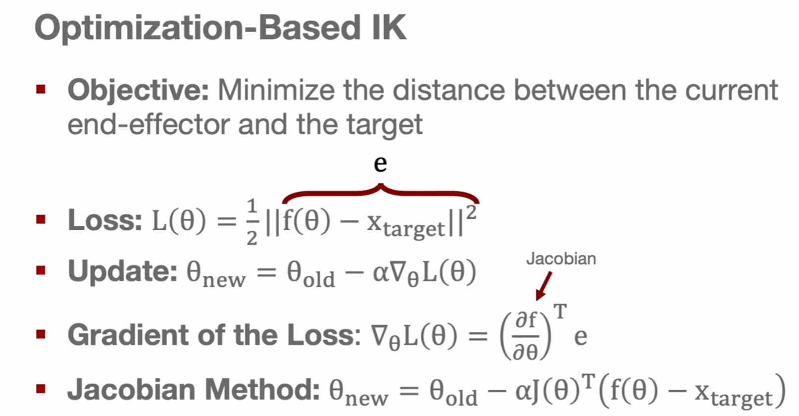

**trajectory Waypoint Generation**

得到目标关节角之后，机器人也不能瞬间“传送”过去，而要生成一串平滑的 waypoint。最简单的线性插值容易带来速度突变和加速度尖峰，对硬件冲击很大。更常见的做法是用五次多项式插值（ quintic splines），为每个关节生成轨迹，并设置起点和终点的速度、加速度为零，从而让运动平滑开始和平滑结束。

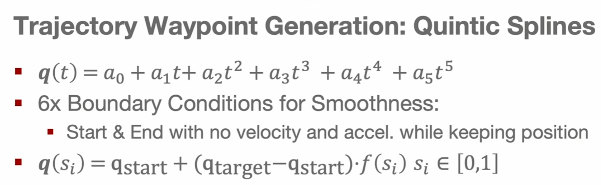

即便轨迹已经规划好，真实机器人也不会自动完美跟随。摩擦、重力、空气阻力、传感器噪声和执行器误差都会造成偏差。因此底层通常还需要 PID 控制器（传统控制）：

- P 项根据当前位置误差产生修正，偏得越远拉回得越强。
- I 项累积长期误差，可补偿重力等持续偏置。
- D 项根据误差变化率抑制过冲，让系统更稳定。

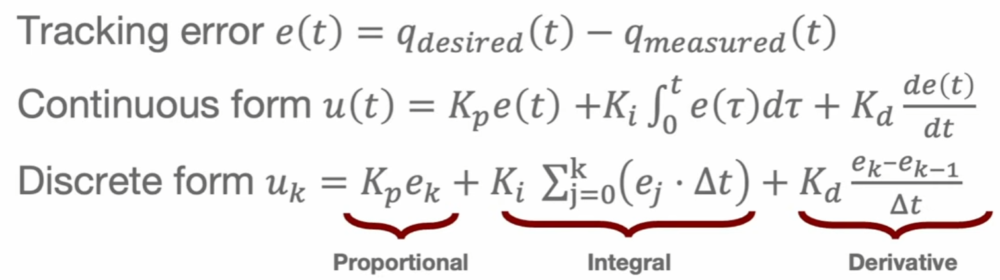

策略学习通常不直接替代所有底层控制。更常见的结构是：高层策略输出目标动作、位姿或 waypoint，底层控制器负责让真实电机尽可能跟随。

### 用 MDP （马尔科夫决策过程）描述机器人决策

仅有控制还不够，因为机器人不只是沿直线移动，而要在不确定环境中做长期决策。例如双臂机器人切寿司，需要抓刀、调整姿态、双手协作、对准目标并完成切割，这不是单个控制命令能解决的。

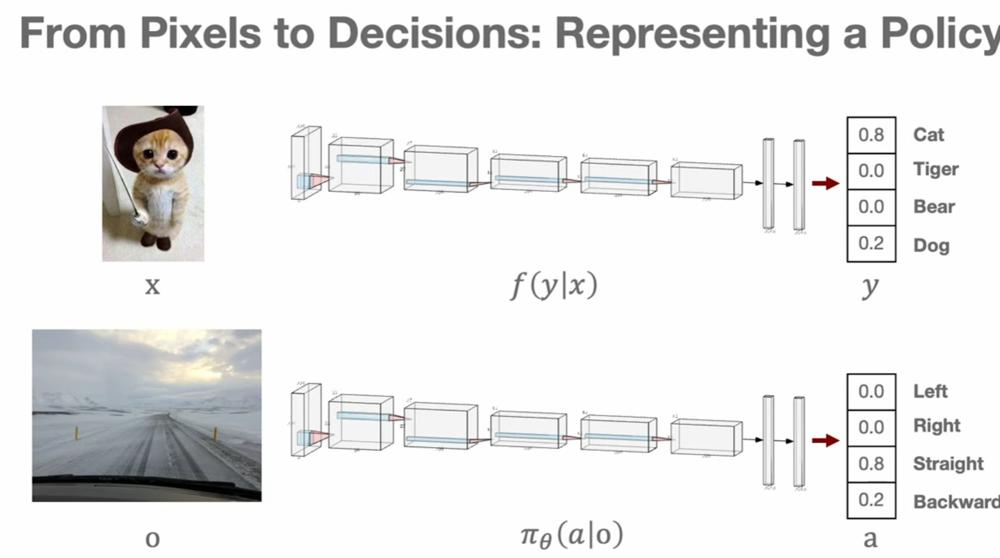

策略$\pi_{\theta}$可以看作从观测到动作的映射。形式上，它是一个条件分布 $\pi_{\theta}(a | o)$：给定当前观测，输出动作概率。策略可以是 stochastic (随机)的，即对多个动作分配概率；也可以是 deterministic （确定性）的，即只选择一个动作。

这里要区分 state 和 observation。state 是世界的真实状态，例如车辆在地图上的精确位置、速度和朝向；observation 是传感器得到的有损信息，例如雪天夜晚的前置摄像头图像。机器人通常只能基于 observation 行动，而不是直接拿到完整 state。

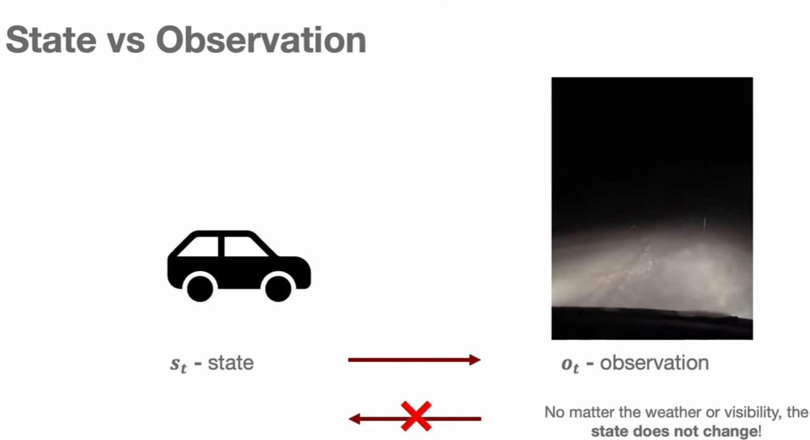

Markov property 指出：如果当前 state 已经包含预测未来所需的全部信息，那么给定当前 state 后，更早的历史不会提供额外信息。MDP 就是基于这个假设的决策框架，通常由状态空间、动作空间、转移概率和奖励函数组成。

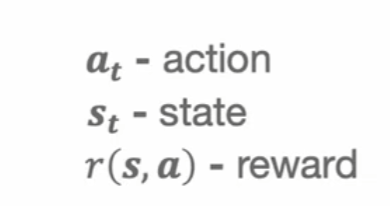

### MDP 的几个核心组成

状态空间和动作空间都可以是离散discrete的，也可以是连续continuous的。棋盘游戏的状态是离散的；机器人关节角、末端位姿和速度通常是连续的。连续空间无法为每个状态建立表格，因此机器人学习通常依赖神经网络这样的函数逼近器。

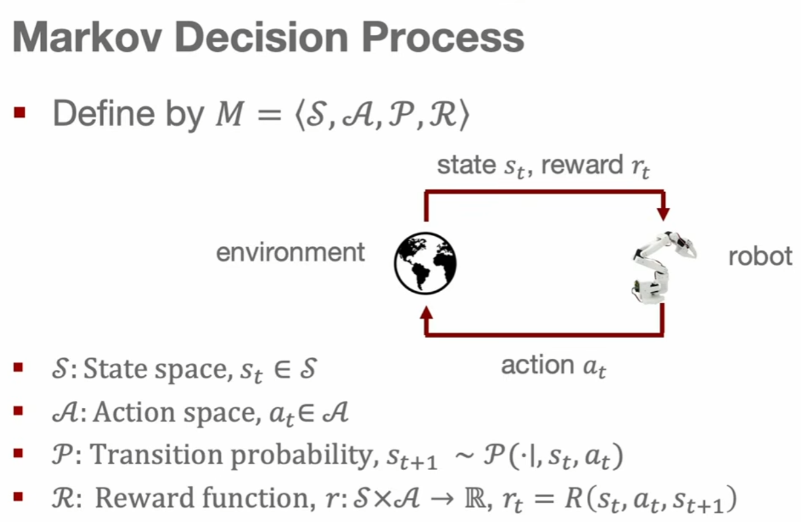

转移模型描述 `state + action` 会把系统带到哪个 next state。理想世界中转移可以是确定性的；真实机器人中则常常是 stochastic 的，因为地面可能打滑，电机可能过冲，传感器也会有噪声。

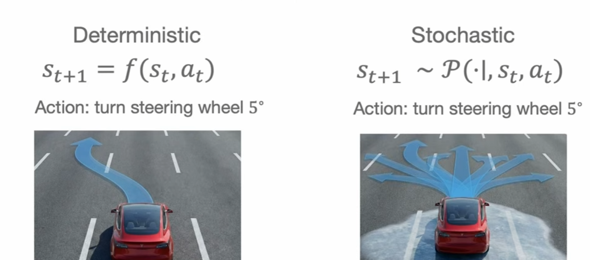

奖励函数定义策略要优化的行为。稀疏奖励sparse rewards只在成功时给 1，否则给 0，例如“抓起物体才有奖励”；稠密奖励dense rewards会提供更连续的学习信号，例如末端执行器到目标物体的欧氏距离。稠密奖励通常能显著加速强化学习，但也需要小心设计，避免奖励形状诱导出错误行为。

机器人运行时产生的是 trajectory：一串状态和动作序列。轨迹概率由初始状态分布、策略在每个状态下选择动作的概率、以及环境转移概率共同决定。轨迹 τ 是状态-动作的序列：

$$
\tau = (s_0, a_0, s_1, a_1, \ldots)
$$

轨迹概率由三部分决定：

$$
P(\tau) = P(s_0) \cdot \prod_t \pi(a_t|s_t) \cdot T(s_{t+1}|s_t, a_t)
$$

| 因子                           | 含义                           |
| ------------------------------ | ------------------------------ |
| **P(s₀)**               | 初始状态概率                   |
| **π(a_t\|s_t)**         | 策略在该状态选择该动作的概率   |
| **T(s_{t+1}\|s_t, a_t)** | 给定动作后转移到下一状态的概率 |

horizon 描述我们关心多长的未来：finite horizon 任务有明确时间限制；infinite horizon 任务理论上持续无限长，常用折扣因子 `gamma` 让近期奖励权重更高。

最终的学习目标是找到最优策略，使所有可能轨迹上的期望累计回报最大化。第 2 讲到这里完成了从机器人几何控制到 MDP 决策框架的连接。

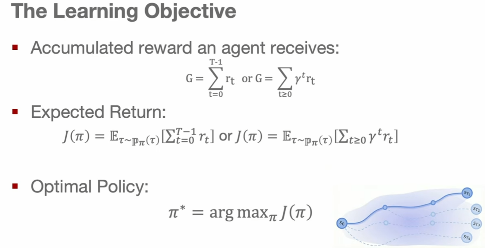

## 模仿学习

模仿学习是第 3 讲的主题。它可以理解为机器人学习中的监督学习：给定专家演示轨迹，学习一个策略，让机器人在相同或相似状态下输出接近专家的动作。

专家轨迹不是随机动作，而是成功完成目标的状态-动作序列，例如人类驾驶数据，或人类遥操作机械臂完成任务的数据。模仿学习的目标是找到神经网络参数 `theta`，使得策略 `pi_theta` 在看到状态或观测时，产生尽可能接近专家的动作。

### Behavior Cloning

最直接的模仿学习算法是 behavior cloning（BC）。对于 deterministic policy，它把问题写成普通回归：输入专家看到的状态或观测，输出专家采取的动作，用 mean squared error 之类的损失训练网络。

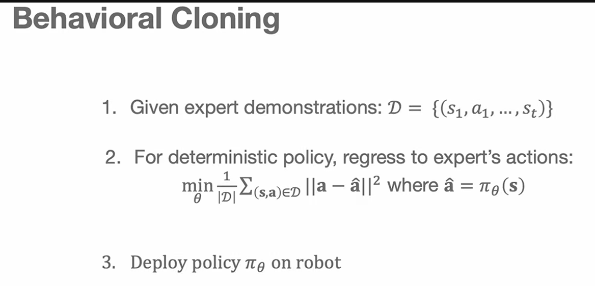

训练过程与常规监督学习很像：从专家数据集中采样 batch，前向传播得到预测动作，计算预测动作和专家动作之间的损失，再反向传播更新参数。这个方法简单、直接，也是很多机器人策略的基础版本。

但 BC 和普通图像分类有一个关键差异：分类器把猫图错标成狗，并不会改变下一张图片；机器人策略做错一个动作，却会改变之后看到的世界。

在监督学习supervised learning中，各个输入是独立同分布（independently,identically distributed, namely i.i.d)。然而在BC(behavior cloning)中，并非如此。出现了drift away

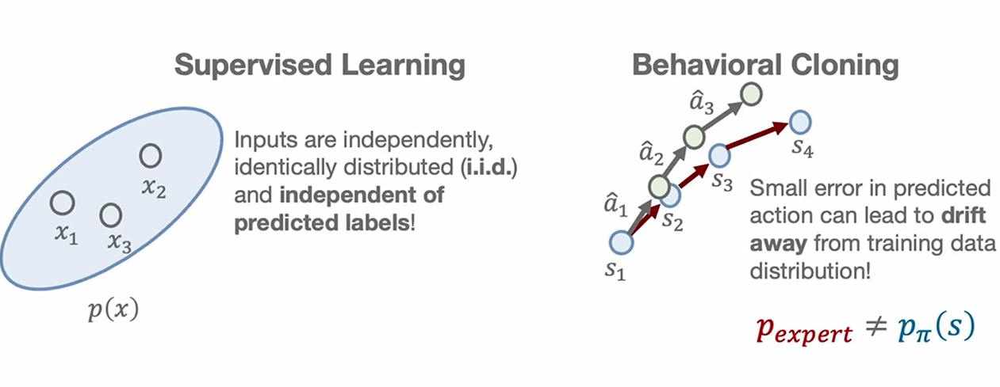

### 分布偏移与误差累积

BC 的核心问题是 i.i.d 假设不成立。专家数据里的状态来自专家策略；部署时机器人访问的状态来自学到的策略。只要策略在某一步出现很小误差，机器人就可能进入专家演示中没有出现过的状态。下一步预测又会在陌生状态上继续出错，于是逐渐偏离（drift）专家轨迹。

自动驾驶是很直观的例子。人类驾驶数据大多来自车道中央，因为正常驾驶不会故意贴近路沿。BC 策略一旦稍微偏离车道中央，就会进入训练集中很少出现的“恢复状态”。如果它没学过如何从这种状态回到车道中央，错误就会继续累积。

NVIDIA 早期端到端驾驶工作用了一个简单有效的数据增强技巧：用左、中、右三个摄像头采集数据。中间摄像头对应正常驾驶；左侧摄像头图像被标注为“向右修正”；右侧摄像头图像被标注为“向左修正”。这样模型在不需要真的把车开到危险位置的情况下，也能学到 recovery behavior。类似思想也被用于苏黎世的森林无人机飞行：人带着三相机装置在森林中行走，用侧向图像生成虚拟转向标签。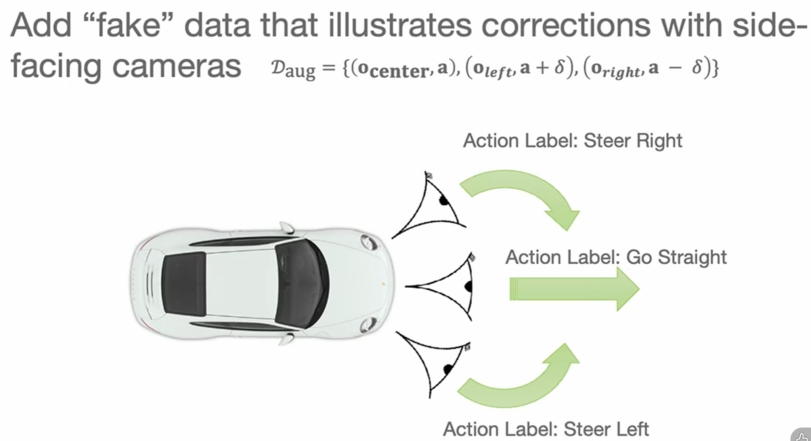

从理论上看，如果每一步都有$\epsilon$的犯错概率，普通监督学习可能直觉上给出 $\epsilon T$ 的线性误差。但 BC 中一旦早期犯错，后续许多步都会落在未见过的状态上，因此总误差上界会变成近似 $O(\epsilon T^2)$。这说明 BC 不是不能用，而是长时序任务中分布偏移会被放大。

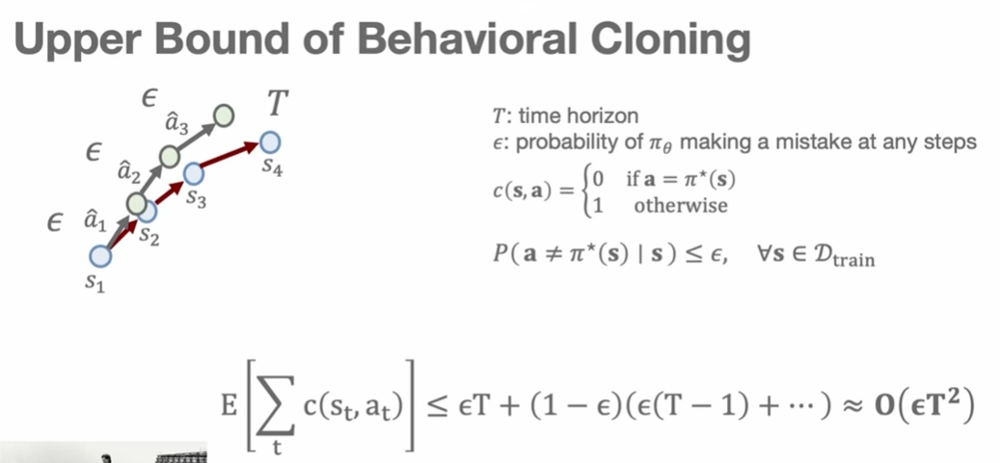

### DAgger 和在线干预

数据集聚合（Dataset Aggregation）算法，主要用于模仿学习中的策略训练，解决行为克隆的复合误差问题.

DAgger（dataset aggregation）的思路是让训练数据覆盖策略自己会访问的状态。流程是：

1. 先用已有专家数据训练一个初始策略。
2. 让该策略在环境中 rollout，收集它实际访问到的状态。
3. 请专家为这些状态标注应该采取的动作。
4. 把新标注加入旧数据集，重新训练策略，并迭代重复。

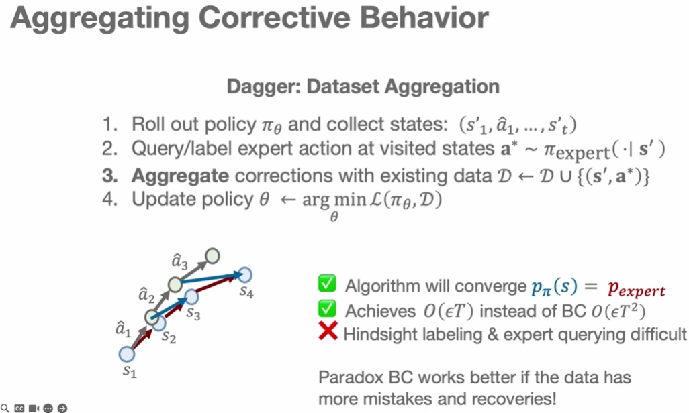

DAgger 的关键是让专家分布和 on-policy 分布靠近，从而把 BC 的二次误差增长改善到更接近线性。但代价也明显：每轮都要请专家为新状态标注，成本高，且事后标注可能存在动作空间不匹配或离散化误差。： **要让模型学习如何纠正错误，就需要在训练数据中提供处于错误状态时的正确动作** 。

一个更自然的变体是 human-gated DAgger，也叫 online intervention(在线干预)。机器人先自己执行任务；当它快要失败时，人类接管并完成后续动作。这类似学车时教练不会全程替你开车，只会在你快撞上路沿时接管方向盘。这样得到的数据往往更有价值，因为它集中包含失败前后的恢复行为。

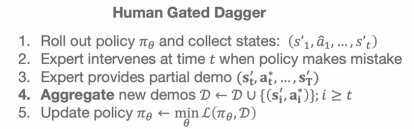

新的问题是：什么时候应该干预？如果总要人类盯着机器人，成本仍然很高。课程中举了语言歧义检测的例子：当用户说“拿黄色的东西”，桌上却有多个黄色物体时，机器人应该意识到指令不确定，主动向人类询问“你是指中间的香蕉吗”。这类机制本质上是在让机器人识别自己的不确定性，并在出错前请求帮助。

### 非 Markov 演示（non markovian behavior)与特权信息

BC 还会受到非 Markov 行为影响。MDP 假设当前 state 足以决定最优动作，但人类专家常常依赖历史、意图、经验甚至情绪。驾驶员看到骑车人时，不只是看一帧图像，而会根据过去几秒的运动趋势判断骑车人接下来可能怎么走。

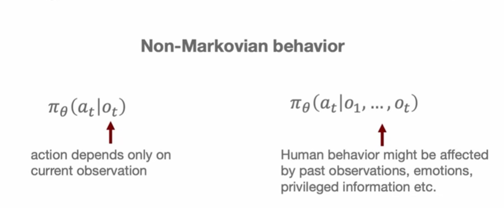

遥操作数据还会带来特权信息（privileged Observation)问题。人类操作者可能直接站在机器人旁边，能看到比机器人摄像头更多的角度和遮挡外的信息；而学到的策略部署时只能看到机器人自己的相机观测。这样一来，同样的机器人观测可能对应专家的不同动作，因为专家当时使用了策略没有看到的信息。

一个直接补救是给策略加入历史，例如输入过去若干帧，用 RNN、LSTM 或 transformer（Seq2Seq Model) 做 sequence-to-sequence behavior cloning。但加入历史不总是更好，因为高容量模型可能产生 causal confusion（因果关系混乱）：它会抓住最容易降低训练损失的虚假相关，而不是正确因果因素。比如每次开抽屉时夹爪力传感器都有 10N 峰值，模型可能误以为“力峰值”触发拉抽屉，而不是“夹住把手”这个视觉状态触发动作。真实部署时力传感器读数稍有变化，策略就可能失效。

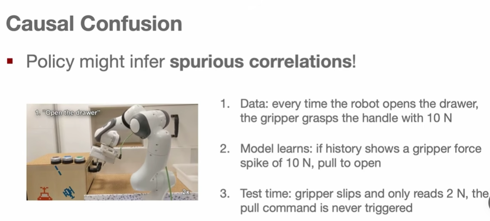

### 多模态行为与均值陷阱

即便专家数据完美，模仿学习还会遇到多模态行为(Multimodal behavior)。机器人冗余、任务冗余和人类习惯差异都会让同一个目标有许多有效做法。关抽屉可以从侧面抓把手，可以从上方推，也可以用不同姿态接近；绕过障碍可以从左边走，也可以从右边走。

**标准 MSE 回归会把多个有效模式平均起来，这在动作空间中可能是灾难性的**。课程用绕树的例子说明：专家轨迹一部分从左边绕，一部分从右边绕，二者平均可能正好撞向树。因此，多模态数据需要能表示多个 action peaks 的策略，而不是只预测一个平均动作。

常见工具有几类：

- Mixture of Gaussians：用多个高斯分量、均值、协方差和权重表示动作分布。它能表达多个模式，但通常要预先设定模式数量。

  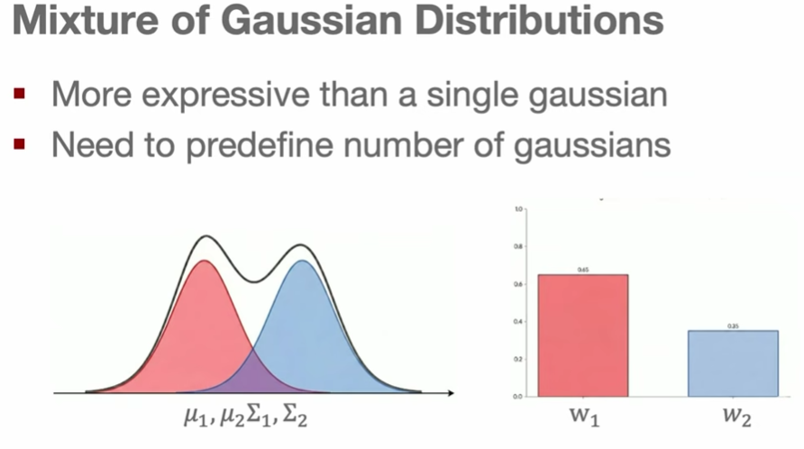
- Discretization（离散化）：把连续动作离散成 bins（箱体），把动作预测变成分类问题。它适合表示多峰分布，但高维动作空间中朴素离散化会指数爆炸。
- Autoregressive per-dimension discretization：按维度自回归预测动作，用链式法则分解联合分布，使复杂度随维度线性增长，但通常需要较大的序列模型。使用vlms等自回归模型。
- Diffusion policies：从噪声开始逐步去噪生成动作，可以表达复杂多模态分布。它和自回归方法都属于迭代式生成，只是一个沿动作维度迭代，一个沿去噪步骤迭代。

  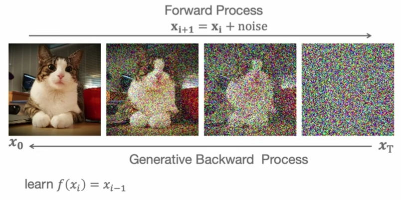
- Latent variable models（隐变量模型）：给策略额外输入一个从先验分布采样的 latent variable，让同一任务下的不同 `z` 对应不同风格或模式。

这里需要区分 task conditioning 和 latent intent。任务条件告诉机器人要做什么，例如“打开抽屉”；latent variable 表示在这个任务内采用哪种方式，例如从左侧接近、从上方接近或用某种特定轨迹执行。

### 从离散任务到 goal reaching

现实任务的边界往往并不清晰。例如“把滑门向左移”到底移到一半算不算成功？有人觉得可以，有人觉得必须完全到位。很多机器人任务不是天然离散的，而是由连续技能和子目标组成。

因此课程引出 goal reaching：不是把行为建模为一组离散 task ID，而是学习一个策略，从任意初始状态到达任意期望目标状态。这样任务和状态都可以保持连续，策略也更接近真实世界中的技能光谱。

### Case Study:从 play data 中学习

一种扩展数据规模的方法是使用 unstructured play data：让人类遥操作机器人在环境中自由玩，不要求按固定任务采集，也不需要每次任务结束后 reset。这类数据高度多模态，但采集更自然，像儿童通过探索理解环境。

为了从 play data 中学习 goal-conditioned control，可以随机截取一段视频窗口，把窗口最后一帧作为目标，通过 goal relabeling 让模型学习“从起始状态到达这帧目标状态需要执行哪些动作”。

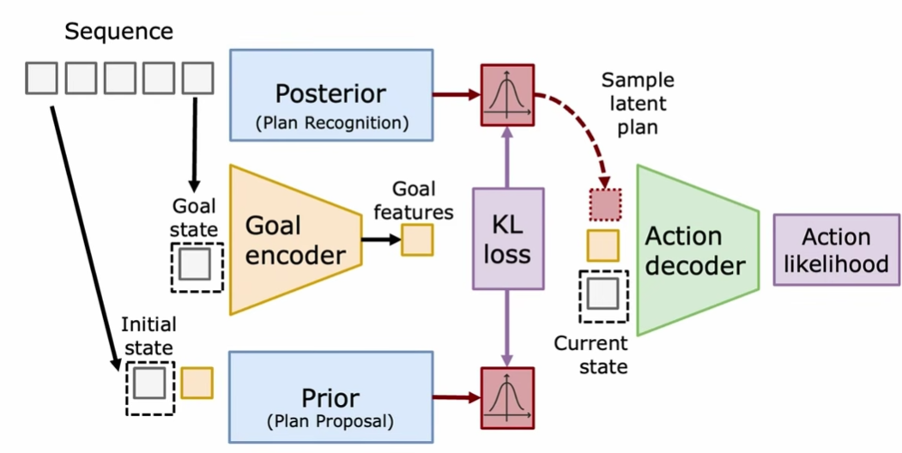

课程中的案例使用 latent plan space 和 conditional variational autoencoder。大致结构是：

- posterior encoder 看到完整演示片段，编码实际发生的行为模式。
- prior 或 plan sampler 只看到初始状态和目标状态，输出可能连接二者的 latent plan 分布。
- action decoder 接收当前观测、目标和 latent plan，预测具体动作。

训练时通过 KL divergence 让 prior 接近 posterior，使 plan sampler 给真实 play data 中出现过的行为较高概率。测试时丢掉 posterior，只用 initial state、goal state 和 plan sampler 生成多模态计划。这样做的好处是把“选择哪种行为模式”交给 latent plan，把 action decoder 从多模态平均问题中解放出来，让它在给定 latent 的条件下学习更接近单峰的动作预测。

同样思想也可以扩展到语言目标：用自然语言目标 embedding 替换或对齐视觉目标 embedding，从而减少人工语言标注负担，同时继续利用大量未标注视觉 play data 。

-VAE和CVAE（generated by Deepseek）

VAE 是一种 **生成模型** ，它结合了自编码器的结构和变分推断的思想。目标是学习一个潜变量空间（latent space），使得可以从这个空间中采样，生成与训练数据相似的新样本（如图像、文本等）。

核心结构

* **编码器（Encoder）** ：将输入数据 x 映射到一个 **分布** （而不是一个固定的向量），通常是高斯分布的参数：均值 μ(x)和方差 σ2(x)。
* **潜变量 z** ：从编码器输出的分布中采样得到，表示数据的潜在特征。
* **解码器（Decoder）** ：将 z 映射回原始数据空间，重构出 x^。

VAE 的损失由两部分组成：

1. **重构损失（Reconstruction Loss）** ：使 x^与原始 x 尽可能相似（如交叉熵或MSE）。
2. **KL散度（KL Divergence）** ：促使编码器输出的分布接近标准正态分布 N(0,I)。这起到了正则化作用，让潜空间连续、平滑，便于采样生成。

总损失：

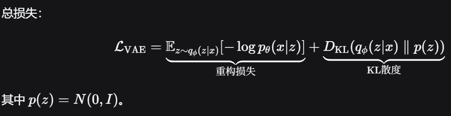

能做什么

* 生成新的、与训练数据相似的样本（生成新的手写数字、人脸等）。
* 学习数据的低维流形。
* 用于异常检测（低重构概率的样本可能是异常点）。

---

## Conditional VAE（CVAE，条件变分自编码器）

### 为什么需要 CVAE？

普通 VAE 生成的样本是**不受控制**的。比如用MNIST训练，你只能随机生成数字，无法指定“生成一个数字 5”。CVAE 通过引入**条件信息**来解决这个问题。

### 核心改进

CVAE 在编码器和解码器的输入中 **同时加入条件变量 c** （例如类别标签、属性描述、文本等）。

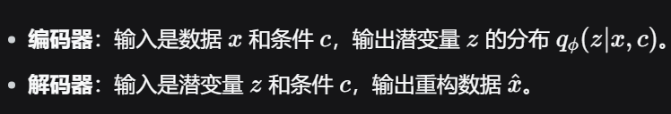

### 训练和生成

* **训练时** ：提供成对的数据 (x,c)，模型学习在给定 c的情况下，如何生成对应的 x。
* **生成时** ：用户指定想要的 c（比如“数字 7”），并从先验 p(z) 中采样一个 z，解码器就能生成**符合该条件**的新样本。

### 损失函数

与 VAE 类似，只是所有分布都加入了条件：

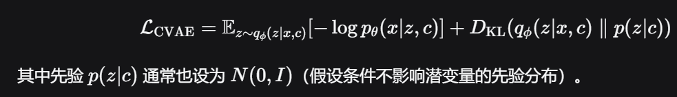

---

## 3. 对比总结

| 特性               | VAE                          | Conditional VAE                                      |
| ------------------ | ---------------------------- | ---------------------------------------------------- |
| **输入**     | 仅数据 x                     | 数据 x+ 条件 c（如标签、文本）                       |
| **生成控制** | 不可控，随机采样             | 可控，通过指定条件 c                                 |
| **潜空间**   | 无条件，可能混合不同类别特征 | 条件信息被分离，潜空间更清晰                         |
| **典型应用** | 随机生成、数据压缩、异常检测 | 条件图像生成（如数字生成、属性编辑）、文本到图像生成 |
| **结构差异** | 编码器和解码器都只接收 x     | 编码器和解码器都额外接收 c                           |

---

## 直观例子

* **VAE** ：给你一堆手写数字图片（0-9），训练后，你随意采样潜变量 z，能生成各种各样的数字，但你不能控制生成的是几。有可能得到混合形状。
* **CVAE** ：训练时，你告诉模型“这张图片是数字5”；生成时，你指定“我要数字5”，模型就能稳定生成清晰的数字5。其他条件同理（如生成“戴眼镜的女性”等）。

### 本两讲主线

第 2 讲建立了机器人动作的物理含义：状态、观测、关节、末端执行器、轨迹和底层控制器共同决定“一个动作”如何在真实世界中发生。MDP 把这些物理动作放进长期决策框架中，用状态、动作、转移、奖励和轨迹描述策略优化问题。

第 3 讲说明了模仿学习为什么是训练机器人策略的自然起点，也说明了它为什么不能被简单看成监督学习。机器人策略的动作会改变之后的数据分布；专家演示可能依赖历史和特权信息；同一个目标可能有多个有效动作模式。解决这些问题，需要 DAgger、在线干预、历史建模、因果约束、多模态分布建模、goal conditioning 和 latent variable models 等工具。

把两讲合在一起看，机器人学习的关键不只是“从图像预测动作”，而是把低层控制、长期决策和数据分布问题同时放在一个系统里处理。一个可用的机器人策略既要能被真实硬件执行，又要能在它自己造成的新状态中稳定行动。

行为克隆出现的问题：

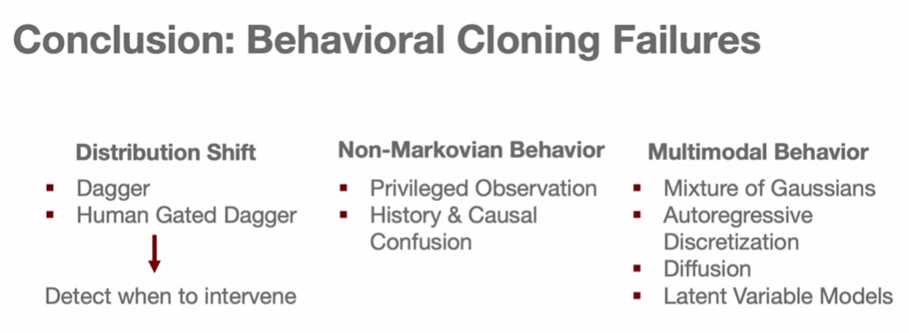

## 附--从仿真到现实：机器人操作的无痛数据飞轮

> **报告人：** Abishek Gupta，华盛顿大学 WEIRD Lab
> **场合：** ETH Zürich，Robot Learning 2026 客座讲座

这两讲讨论的是同一个连续问题的不同侧面：第 2、3 讲关注机器人如何把目标变成动作，以及如何从数据中学习策略；本讲座则追问一个更上游的问题——这些数据本身从哪里来？如果真实世界数据采集成本过高，仿真能否成为一条可行的替代路径，而它带来的隐性工程成本又该如何消除？

### 端到端学习的数据瓶颈

过去几十年，机器人学的主流范式是感知-规划-执行（sense-plan-act）：先做状态估计，再建模和规划，最后用底层控制器执行。这套范式在结构化工业场景中运转良好，但每进入一个新领域，就需要重新设计代价函数、运动原语和控制器——工程量巨大。

端到端学习（robotics 2.0）的愿景是用一个大型神经网络直接从传感器输入映射到控制输出，跳过中间所有手工设计环节。这个思路在视觉和语言领域已经被验证：从 MNIST 到 ImageNet 到 LAION，从 Twitter 情感数据集到 Common Crawl，数据规模增长了数个量级。但这些增长有一个关键特征——它是**被动的**。人们本来就在使用互联网，文本和图像数据自然积累，无需额外采集。

机器人领域没有这种被动数据流。真实世界中部署的机器人数量有限，应用场景也不够多样。当前最主流的数据采集手段是遥操作：通过 UMi 夹爪、VR 手套等设备让人类控制机器人完成任务。这比早期方法好得多，但仍然是主动采集——需要人到现场、需要设备、需要在不同环境中反复操作。要达到视觉和语言领域的数据规模，所需的经费和时间远超任何研究团队的承受能力。

一个务实的方向是利用**离域数据（off-domain data）**：与机器人相关、但不在物理机器人上采集的数据。生成模型产生的合成数据、大规模视频数据集、以及本讲座聚焦的**仿真数据**，都属于这一类。离域数据天然存在质量问题——它永远不如真实机器人上专家采集的数据准确。但它可以是有用的，前提是理解它的局限并找到正确的使用方式。

### 仿真的承诺与隐性成本

仿真数据在原则上比真实数据便宜得多，因为你花的是计算时间而非人工时间。除此之外，仿真还提供一系列真实世界不具备的特权：你知道所有物体的精确位姿（特权信息），你可以瞬间将环境重置到任意状态（简单重置），你可以定义精确的奖励函数，你还可以让仿真以远超实时的速度运行。这些优势已经催生了足式机器人和人形机器人领域的大量突破性进展。

但"在原则上便宜"这个限定词至关重要。当你真正尝试把仿真用于机器人操作时，会发现大量隐性成本隐藏在三个环节中：

第一个环节是**场景设计**。你需要有人——通常是博士生或专业建模师——进入 Blender，手动搭建环境，拖拽物体，调整物理参数和几何形状，反复修改直到场景看起来合理。这个过程可能耗费数天。

第二个环节是**行为生成**。有了场景之后，你需要让机器人在其中执行任务。常见做法是让人通过 VR 接口在仿真中遥操作采集数据，或者编写强化学习的奖励函数。后者往往是一张充满各种项和随机权重的公式表，设计过程极其繁琐。

第三个环节是**系统辨识**。当仿真中训练好的策略迁移到真实世界时，你发现仿真器的物理并不完全匹配现实。于是你需要回去调整参数、修正模型、在仿真与现实之间反复迭代，直到迁移效果可以接受。

这三个环节加起来，使得"仿真数据更便宜"这个前提在操作任务中往往不成立。本讲座的核心目标就是系统性地消除这三个环节的人工成本。

### 真实到仿真：从视频自动生成交互场景

第一个要消除的瓶颈是场景设计。如果我们能直接拍摄一段真实环境的视频，自动从中生成一个物理可交互的仿真场景，就不再需要人工建模了。

这个想法的实现依赖三维视觉和基础模型的最新进展。第一步是使用高斯溅射（Gaussian Splatting）从多视角图像或视频重建场景的高保真几何和外观。高斯溅射可以从原始相机画面出发，生成高质量的新颖视角渲染，同时提取底层网格几何。关键挑战在于将视觉外观与几何形状对齐，使得渲染结果既好看又具备物理意义。

第二步是利用基础模型（Grounded SAM 和 GPT-4 等）对场景中的物体进行分割和分类：哪些是柜子、哪些是抽屉、哪些是洗碗机、哪些是冰箱。第三步是为每个分割出的物体附加铰接信息——铰链、关节和自由度——使其成为物理可交互的对象。

最终效果是：你拿着 iPhone 拍摄一段厨房视频，经过计算处理后，得到一个外观与真实场景高度相似、且所有柜门可开、抽屉可拉、物体可移的完整仿真环境。整个过程不需要人工建模，只需要计算资源。对不同厨房重复这一流程，就能批量生成多样化的交互式场景。

#### 仿真作为评估工具

除了数据生成，高保真重建场景还有一个容易被忽视的用途：**策略评估**。在真实世界中评估机器人策略极其耗时——每次实验都需要人在场操作、重置、记录结果。如果能在仿真中可靠地评估策略，就可以大幅加速算法迭代。

具体做法是：将在真实世界中训练好的策略（例如 Physical Intelligence 的策略，完全未使用仿真数据训练）迁移回仿真场景中运行。衡量标准是两个指标的联合：皮尔逊相关系数应足够高（仿真中的成功率与真实世界成功率线性相关），排序违反率应足够低（在仿真中 A 策略优于 B 策略，则真实世界中也应如此）。

实验表明，在高度逼真的场景中，这两个指标表现良好。但当场景保真度下降时，相关性显著恶化。一个重要的实践经验是：在训练数据中混入少量仿真数据，让模型适应仿真域的视觉风格，之后就能在新场景上进行可靠评估。这使得"在仿真中做大规模评估"变得可行，即使策略本身完全在真实数据上训练。

### 行为生成：利用特权重置消除奖励设计和示范采集

场景有了，接下来的问题是：如何让机器人在仿真中学会执行任务？

传统做法有两种。一是人类遥操作：让人进入 VR 界面控制机器人完成任务，录制示范数据。二是强化学习加手工奖励设计：写一个包含大量项和权重的密集奖励函数，用 RL 训练策略。两种方法都需要大量人工投入。

Abishek Gupta 的学生 Tyler 和 Patrick 提出了一个更简洁的方案：利用仿真独有的**重置特权**，仅用稀疏奖励（成功/失败），无需任何示范，就能让 RL 学会复杂的操作行为。

核心思想如下。强化学习中最困难的部分是探索：智能体从初始状态出发进行随机尝试，需要偶然触碰目标才能获得正向信号。这就像大海捞针。如果目标距离起始状态很远，纯随机探索几乎不可能成功。传统解法是设计密集奖励来引导搜索方向，但如前所述，这本身就需要大量人工。

仿真的重置特权提供了一条捷径。你不必总是从同一个起始状态出发，而是可以将智能体重置到环境中的**任意状态**。具体做法是：

1. 定义目标状态（如完全组装好的桌子）。
2. 程序化生成大量多样化的重置状态：部分组装的状态、部分抓取的状态、机械臂在不同位置的状态等。
3. 从这些重置状态出发运行 RL，仅使用稀疏的二值奖励。

如果重置状态恰好在目标旁边，智能体只需解决一个很简单的短时域问题。然后逐步增加重置状态与目标之间的距离，形成一个自动化的课程学习过程。本质上，这是用仿真中免费的"传送"能力，把一个困难的长时域探索问题拆解为一系列简单的短时域问题。

实验结果令人印象深刻。在没有任何示范的情况下，仅靠稀疏奖励和大规模重置，智能体涌现出了丰富的操作行为：非抓取调整（扭动、翻转、利用环境接触滑动物体）、家具组装（将部件抬起越过障碍、利用物体边缘作为引导）、以及拾取放置中的创造性环境利用。更关键的是，**同一套代码**适用于不同任务——只需更换 CAD 模型，无需修改奖励函数或任何超参数。

生成的策略还展现出很强的鲁棒性。与窄范围采集的示范数据训练出的策略相比，基于大范围重置的 RL 策略在更多初始构型下都能成功。例如桌子组装任务中，策略在桌面任意位置放置桌腿都能完成组装。

### 仿真到真实：世界模型预训练与微调

场景和行为都在仿真中解决了，最后一步是把成果迁移到真实世界。仿真与现实之间始终存在差距——物理接触、摩擦力、动力学细节都不完全准确。传统做法是做系统辨识：手动调整仿真器参数，反复在仿真与现实之间迭代。这既费力又依赖领域知识。

Gupta 提出了一个更优雅的思路：**不要试图让仿真变完美，而是让算法自动适应差距**。

关键洞察是：仿真虽然在局部物理精度上有缺陷，但它能很好地捕捉任务的**全局结构**。以家具组装为例，仿真正确地建模了"拾取桌腿 → 插入孔中 → 旋转锁定"这个高层策略序列，但在插入过程中精确的力曲线可能有偏差。这启发了一种两层方法：用仿真覆盖全局规划，用少量真实数据修正局部动力学。

具体实现是世界模型（world model）的预训练与微调。世界模型是一种预测性动力学模型：给定当前状态和动作，预测下一个状态。做法是：

1. 在仿真中预训练世界模型，使其学会长时域的任务结构和全局规划。
2. 冻结模型的长时域组件。
3. 仅用少量自主采集的真实世界数据微调短时域预测组件。

这类似于大语言模型中的微调范式：大部分知识来自大规模预训练（此处是仿真），只需一小层适配到目标域（此处是真实物理）。整个微调过程可以自主运行——机器人在真实世界中尝试执行任务，收集失败和成功经验，自动更新模型。

实验表明，仅需 15 分钟的真实世界数据采集，就能将仿真中预训练的策略从"完全不可用"提升到"可靠成功"。家具组装任务中，初始迁移效果在精确插入阶段失败，微调后完整组装成功。动态操作任务中，模型甚至学会了翻转物体等仿真本身无法精确模拟的动态运动。四足机器人行走任务中，该方法修正了步态中的物理误差，同时保留了仿真中学到的全局步态结构。

### 总结

回顾整个框架，Gupta 的团队系统性地消除了仿真用于机器人操作的三个隐性成本：

**场景创建**：从数天手工建模降至数分钟视频采集加计算。高斯溅射加基础模型将任意真实环境自动转化为物理可交互的仿真场景。

**行为生成**：从需要大量人工的示范采集和奖励设计降至零人工。特权重置 RL 用稀疏奖励和自动化课程学习生成多样化、鲁棒的操作行为，同一代码跨任务复用。

**真实世界部署**：从繁琐的系统辨识降至 15 分钟自主数据采集。世界模型在仿真中预训练全局结构，少量真实数据微调局部动力学。

贯穿始终的设计哲学是：仿真不是万能药，它的物理模型天然不完美。但如果使用方式得当——利用计算资源替代人工建模，利用重置特权替代奖励设计，利用预训练-微调范式替代系统辨识——仿真就能成为机器人学习中真正可扩展的数据来源。目标不是追求仿真的完美，而是用最小的人工成本最大化数据的多样性和实用性。
