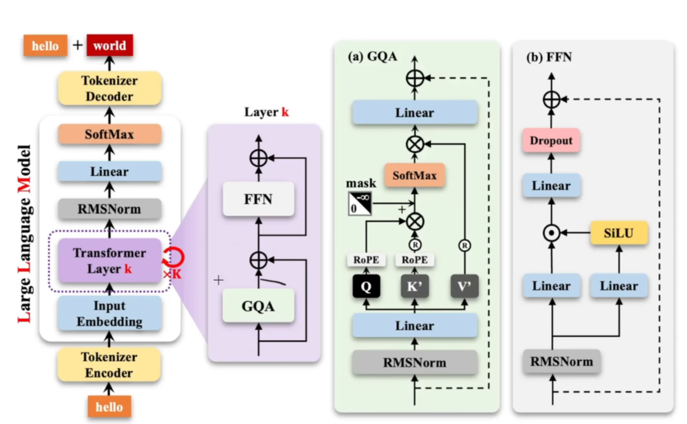
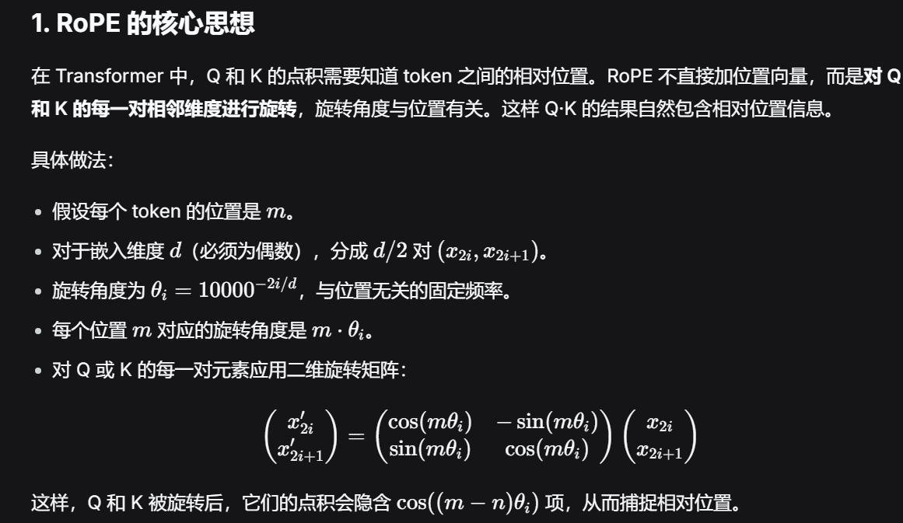
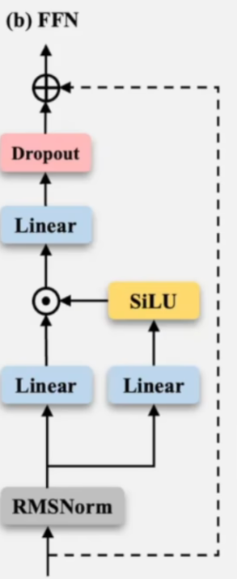

# 走完大模型构建全流程1



## RMS Norm

RMSNORM 正则（归一化）

如果输入X过大过小，导致梯度爆炸、消失。

归一化，标准差变1

RMSnorm比传统Norm少了均值的相关计算

$y_i=\frac{x_i}{\sqrt{\sum_{i==1}^n x_i^2}+\sigma}*\gamma$

(其中，$\gamma$是可学习的参数)

代码实现：

```python
class RMSNorm(nn.Module):
    def __init__(self, dim:int,eps:float=1e-5):
        super().__init__()
        self.dim=dim
        self.eps=eps
        self.weight=nn.Parameter(torch.ones(dim)) #可学习的参数gamma
  
    def _norm(self,x):
        return x*torch.rsqrt(x.pow(2).mean(-1,keepdim=True)+self.eps)

#__init__初始化

#主要逻辑

#前向forward
    def forward(self,x):
        return self.weight*self._norm(x.float()).type_as(x)
```

## RoPE

文本的先后位置与语义有很大关系，因此需要位置编码（相对位置、绝对位置）

使用相对位置编码，旋转位置编码（RoPE、YaRN）

## 为什么 Transformer 需要位置编码

### 核心问题：Self-Attention 的置换不变性

Transformer 的核心组件是 **Self-Attention（自注意力机制）**。其计算公式为：

$$
\text{Attention}(Q, K, V) = \text{softmax}\left(\frac{QK^T}{\sqrt{d_k}}\right)V
$$

其中：

- $Q = XW_Q$，$K = XW_K$，$V = XW_V$
- $X \in \mathbb{R}^{n \times d}$ 是输入序列的嵌入矩阵，$n$ 是序列长度，$d$ 是嵌入维度

**关键观察**：Self-Attention 本质上是对输入序列做**加权求和**，而加权求和操作具有**置换不变性（Permutation Invariance）**。

具体来说，如果我们打乱输入序列的顺序：

$$
X' = \Pi X
$$

其中 $\Pi$ 是任意置换矩阵，则：

$$
\text{Attention}(X'W_Q, X'W_K, X'W_V) = \Pi \cdot \text{Attention}(XW_Q, XW_K, XW_V)
$$

这意味着：**无论输入序列中 token 的顺序如何，Self-Attention 的输出（在重排后）完全相同**。

### 为什么这成为问题

语言是有序的。同一个句子中词语的顺序不同，含义完全不同：

| 句子   | 含义       |
| ------ | ---------- |
| 猫追狗 | 猫是施动者 |
| 狗追猫 | 狗是施动者 |

如果模型无法区分位置，那么"猫追狗"和"狗追猫"在模型看来就是相同的输入——这显然无法完成任何有意义的语言理解任务。

位置编码的目标是**打破置换不变性**，将序列中每个 token 的位置信息注入到模型中。形式化地说，我们需要一个函数 $f$，使得：

$$
h_i = x_i + f(i)
$$

或者更一般地：

$$
h_i = g(x_i, i)
$$

其中 $i$ 是位置索引，$h_i$ 是注入了位置信息的表示。这样，模型就能区分不同位置上的 token。

## 3. RoPE 详细理论推导

### 3.1 设计目标

RoPE 的设计目标是：找到一种位置编码函数 $f(x, m)$，使得 query 向量和 key 向量的内积**仅依赖于相对位置**：

$$
\langle f(q, m), f(k, n) \rangle = g(q, k, m - n)
$$

其中 $m, n$ 分别是 query 和 key 的绝对位置，$g$ 是某个只与相对位置 $m - n$ 有关的函数。

### 3.2 二维情况的推导

为了建立直觉，我们先从最简单的二维情况开始。

#### 3.2.1 问题设定

对于二维向量 $q = (q_0, q_1)^T$，我们希望找到函数 $f(q, m)$，使得：

$$
f(q, m)^T f(k, n) = g(q, k, m - n)
$$

#### 3.2.2 旋转矩阵的直觉

在二维空间中，一个自然的选择是**旋转操作**：

$$
f(q, m) = R(m) \cdot q
$$

其中 $R(m)$ 是旋转角度为 $m\theta$ 的旋转矩阵：

$$
R(m) = \begin{pmatrix} \cos(m\theta) & -\sin(m\theta) \\ \sin(m\theta) & \cos(m\theta) \end{pmatrix}
$$

#### 3.2.3 验证条件

计算内积：

$$
\begin{aligned}
f(q, m)^T f(k, n) &= (R(m)q)^T (R(n)k) \\
&= q^T R(m)^T R(n) k \\
&= q^T R(-m) R(n) k \\
&= q^T R(n - m) k
\end{aligned}
$$

这里利用了旋转矩阵的性质：

- $R(m)^T = R(-m)$（转置等于反向旋转）
- $R(-m) R(n) = R(n - m)$（旋转的复合）

因此，$g(q, k, m - n) = q^T R(n - m) k$，它确实只依赖于相对位置 $m - n$!

### 3.3 推广到高维

#### 3.3.1 分块旋转

对于 $d$ 维向量（$d$ 为偶数），我们将 $d$ 维空间分成 $d/2$ 个二维子空间，每个子空间独立应用旋转：

$$
R_{\Theta, m} = \begin{pmatrix}
R_1(m) & 0 & \cdots & 0 \\
0 & R_2(m) & \cdots & 0 \\
\vdots & \vdots & \ddots & \vdots \\
0 & 0 & \cdots & R_{d/2}(m)
\end{pmatrix}
$$

其中每个 $R_i(m)$ 是二维旋转矩阵：

$$
R_i(m) = \begin{pmatrix} \cos(m\theta_i) & -\sin(m\theta_i) \\ \sin(m\theta_i) & \cos(m\theta_i) \end{pmatrix}
$$

#### 3.3.2 频率的选择

每个二维子空间对应一个旋转频率 $\theta_i$。RoPE 采用与原始 Transformer 正弦编码类似的几何级数：

$$
\theta_i = 10000^{-2i/d}, \quad i = 0, 1, \ldots, d/2 - 1
$$

展开来说：

- $\theta_0 = 1$（最高频，对应前两个维度）
- $\theta_1 = 10000^{-2/d}$
- $\theta_2 = 10000^{-4/d}$
- $\cdots$
- $\theta_{d/2-1} = 10000^{-(d-2)/d} \approx 10000^{-1}$（最低频，对应最后两个维度）

**直觉理解**：

- **高频分量**（小 $i$）：旋转速度快，对位置变化敏感，捕捉局部位置关系
- **低频分量**（大 $i$）：旋转速度慢，对位置变化不敏感，捕捉全局位置关系

这类似于傅里叶变换中不同频率分量的作用。

#### 3.3.3 完整的旋转矩阵

将位置 $m$ 处的 $d$ 维向量 $x = (x_0, x_1, x_2, x_3, \ldots, x_{d-2}, x_{d-1})^T$ 应用 RoPE：

$$
f(x, m) = R_{\Theta, m} \cdot x
$$

展开为：

$$
f(x, m) = \begin{pmatrix}
x_0 \cos(m\theta_0) - x_1 \sin(m\theta_0) \\
x_0 \sin(m\theta_0) + x_1 \cos(m\theta_0) \\
x_2 \cos(m\theta_1) - x_3 \sin(m\theta_1) \\
x_2 \sin(m\theta_1) + x_3 \cos(m\theta_1) \\
\vdots \\
x_{d-2} \cos(m\theta_{d/2-1}) - x_{d-1} \sin(m\theta_{d/2-1}) \\
x_{d-2} \sin(m\theta_{d/2-1}) + x_{d-1} \cos(m\theta_{d/2-1})
\end{pmatrix}
$$

### RoPE 的核心数学性质

#### 性质 1：相对位置性

$$
\langle f(q, m), f(k, n) \rangle = \text{Re}\left[\sum_{j=0}^{d/2-1} q_j \bar{k}_j \cdot e^{i(m-n)\theta_j}\right]
$$

内积只依赖于相对位置 $m - n$。

#### 性质 2：远程衰减

随着相对距离 $|m - n|$ 增大，内积趋向于衰减。这是因为不同频率分量 $e^{i(m-n)\theta_j}$ 的贡献会相互抵消（类似于多频信号的干涉效应）。

数学上可以证明，当 $d$ 足够大时：

$$
\langle f(q, m), f(k, n) \rangle \approx C \cdot \frac{\sin(d \cdot \Delta / 2)}{d \cdot \sin(\Delta / 2)}, \quad \Delta = (m-n) \cdot \theta_0
$$

这是一个随 $|m - n|$ 增大而衰减的振荡函数。

#### 性质 3：线性复杂度

RoPE 的计算不需要额外的参数，只需要对 Q 和 K 的每个位置应用旋转，时间复杂度为 $O(nd)$。

## RoPE 实现详解

### 核心实现思路

直接构造 $d \times d$ 旋转矩阵效率低下。RoPE 的高效实现利用了一个关键观察：**旋转操作可以分解为逐对的元素级操作**。

对于每对 $(x_{2i}, x_{2i+1})$：

$$
x'_{2i} = x_{2i} \cos(m\theta_i) - x_{2i+1} \sin(m\theta_i)
$$

$$
x'_{2i+1} = x_{2i} \sin(m\theta_i) + x_{2i+1} \cos(m\theta_i)
$$

### 高效版本（避免交错操作）

高效的做法是利用数学恒等式：

$$
x'_{2i} = x_{2i} \cos - x_{2i+1} \sin
$$

$$
x'_{2i+1} = x_{2i} \sin + x_{2i+1} \cos
$$

可以重写为：

$$
x' = x \cdot \cos + \text{rotate\_half}(x) \cdot \sin
$$

其中 $\text{rotate\_half}(x)$ 将 $[x_0, x_1, x_2, x_3, \ldots]$ 变为 $[-x_1, x_0, -x_3, x_2, \ldots]$

```python
def apply_rotary_pos_emb_efficient(q, k, cos, sin):
    """高效 RoPE 实现"""

    def rotate_half(x):
        x1 = x[..., : x.shape[-1] // 2]
        x2 = x[..., x.shape[-1] // 2 :]
        return torch.cat([-x2, x1], dim=-1)

    cos = cos.unsqueeze(0).unsqueeze(2)
    sin = sin.unsqueeze(0).unsqueeze(2)

    q_embed = q * cos + rotate_half(q) * sin
    k_embed = k * cos + rotate_half(k) * sin

    return q_embed, k_embed
```

### 4.3 完整的 Transformer 层示例

```python
class MultiHeadAttentionWithRoPE(nn.Module):
    """带 RoPE 的多头注意力"""

    def __init__(self, d_model: int, num_heads: int, max_seq_len: int = 8192):
        super().__init__()
        self.d_model = d_model
        self.num_heads = num_heads
        self.head_dim = d_model // num_heads

        self.q_proj = nn.Linear(d_model, d_model)
        self.k_proj = nn.Linear(d_model, d_model)
        self.v_proj = nn.Linear(d_model, d_model)
        self.o_proj = nn.Linear(d_model, d_model)

        self.rope = RotaryPositionalEmbedding(self.head_dim)

    def forward(self, x: torch.Tensor, mask: torch.Tensor = None):
        batch, seq_len, _ = x.shape

        q = self.q_proj(x).view(batch, seq_len, self.num_heads, self.head_dim)
        k = self.k_proj(x).view(batch, seq_len, self.num_heads, self.head_dim)
        v = self.v_proj(x).view(batch, seq_len, self.num_heads, self.head_dim)

        # 应用 RoPE 到 Q 和 K（V 不需要位置编码）
        cos, sin = self.rope(x, seq_len)
        q, k = apply_rotary_pos_emb(q, k, cos, sin)

        q = q.transpose(1, 2)
        k = k.transpose(1, 2)
        v = v.transpose(1, 2)

        scale = self.head_dim**-0.5
        attn_weights = torch.matmul(q, k.transpose(-2, -1)) * scale

        if mask is not None:
            attn_weights = attn_weights.masked_fill(mask == 0, float("-inf"))

        attn_weights = torch.softmax(attn_weights, dim=-1)
        attn_output = torch.matmul(attn_weights, v)

        attn_output = (
            attn_output.transpose(1, 2).contiguous().view(batch, seq_len, self.d_model)
        )
        return self.o_proj(attn_output)
```

## YaRN (Yet another RoPE extensioN)

YaRN 结合了 NTK 和注意力缩放，对不同频率应用不同的缩放策略：

- **低频分量**：使用插值（缩放位置）
- **高频分量**：保持不变

```python
def yarn_rope(dim, seq_len, train_len, target_len, base=10000.0):
    """YaRN RoPE 简化版"""
    import math

    scale = target_len / train_len
    wavelength = 2 * math.pi / (base ** (torch.arange(0, dim, 2).float() / dim))
    low_freq_factor = train_len / (2 * math.pi)

    inv_freq = []
    for w in wavelength:
        if w > low_freq_factor:
            inv_freq.append(1.0 / (w * scale))
        else:
            inv_freq.append(1.0 / w)

    inv_freq = torch.tensor(inv_freq)
    # ... 后续与标准 RoPE 相同
```




## FFN层



$$
(\text{SiLU}(XW_1) \cdot XW_2)W_3
$$

为了保证总参数为8l^2，三个W都把维度调整到$\frac{8}{3}l$

$$
\text{SiLU}=\frac{x}{1+e^{-x}}
$$


动态学习率

余弦退火方法

---
